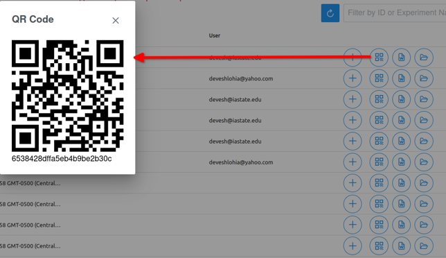

# Documentation for DOPE App

## Overview -

This application enables research scientists to manage data related to the experiments and share it with the team.
It helps in -

1. Storing the data and files bind it to the experiment.
2. Tracking the experiments using QR Code.
3. Searching the experiments from the database.
4. Filtering the experiments based data.
5. Generating plots for the data of the files uploaded.

## Getting Started:

- Prerequisites -
  Node.js version - 14 and npm should be installed.
  Rest of the requirements are stated in package.json file.

- Installation steps (how to clone the repo, install dependencies).
  To obtain the repository run the following commands-
    * git clone https://devesh-iastate@bitbucket.org/devesh-iastate/dope-frontend.git

  - How to run the project locally.
    To run the project locally run the following commands -
    * cd dope-frontend
    * Copy .env file to the project
      * npm install
      * npm run build
      * Open this link in your browser - http://localhost:3000/

  - ENV file variables explained :
    * REACT_APP_MONGO_APP_ID : This is application id of MongoDB. This enables sending data to DB directly from the frontend.
    * REACT_APP_DIGITAL_OCEAN_URL : It is api endpoint for the backend of the application. (local - http://127.0.0.1:8000/api/), procution value is shared in env file.
    * REACT_APP_ADMIN_ACCOUNT : The admin account which controls sign up for other users.

---

---

## Folder Structure -

The folder structure is as follows -


All the components are available in `src` folder.

## **Context :** UserContext Component for React

The `UserContext` component is designed to facilitate user authentication and state management across different components and pages in a React application, leveraging MongoDB Realm's authentication system.

## Features

1. **Realm App Integration**: Integrates with MongoDB Realm via a Realm App instance.

2. **Context API Utilization**: Employs React's Context API for global state management of user data.

3. **User State Management**: Manages the user's authentication status using React's state hooks.

4. **Authentication Functions**: Provides essential authentication functionalities such as login, signup, logout, and user session fetching.

## Functionalities

### emailPasswordLogin

- **Purpose**: Enables user login with email and password.
- **Parameters**: `email`, `password`
- **Returns**: User object on successful authentication.

### emailPasswordSignup

- **Purpose**: Handles user registration and automatic login.
- **Parameters**: `email`, `password`
- **Returns**: User object post-registration and login.

### fetchUser

- **Purpose**: Retrieves the currently logged-in user.
- **Returns**: Current user object or `false` if no active session.

### logOutUser

- **Purpose**: Facilitates user logout.
- **Returns**: `true` on successful logout, otherwise `false`

## Usage Instructions

1. **Application Setup**:

   Wrap your main application with the `UserProvider` to ensure global availability of user context.

   ```jsx
   import { UserProvider } from "./path-to-UserContext";

   const App = () => (
     <UserProvider>{/* Rest of your application */}</UserProvider>
   );
   ```

2. **Accessing Context**:

   Utilize the `UserContext` in your components to interact with user data and authentication methods.

   ```jsx
   import React, { useContext } from "react";
   import { UserContext } from "./path-to-UserContext";

   const MyComponent = () => {
     const { user, emailPasswordLogin } = useContext(UserContext);

     // Use `user` for user data, `emailPasswordLogin` for logging in users, etc.
   };
   ```

## User Access -

Login in handled by Mongodb and userContext.
Types of users -

1. Research Scientist - They can create experiments, see expriment data and visualize the data via charts.
2. Admin - All the features of Research Scientist along with ability to create new users.

## Login Screen -


This is login screen for the Dope Portal. It takes username and password.
The username is binded with the user role.
If the user is Admin, the website provides some extra functinalities for admin roles.

## New User Signup -

For accessing the website, a request is needed to be generated to admin.
Admin user will have access to Sign up. Admin user will be able to add the user in the following way -

1. Login with admin user.
2. Once logged in, they will see a **Admin** button on top. Click on the button.
3. Fill all the required details and new user will have the access.
4. Once the new user is created, the user can login with the provided password or click on Forgot Password Button to reset the password.
5. This is send an email to their email address for resetting the password.

### Note:

If you want to remove the access of a user from the website, that has to be done from the backend by removing the user from the mongodb atlas admin page.

## The Main Dashboard -

The UI for dashboard is available in src/pages/Home.page.js

For Admins -


For Research Scientists -


This Component is present in src/

The image shows layout for the main dashboard for a normal user.
It shows all the experiments data.
There are following functionalities available through admin dashboard -

1. Create New: Enables creation of new experiment
2. Scan: Enables sharing of data through QR code. The QR code enables sharing of data through QR codes.
3. Show Chart: Used to visualize data
4. Search : Enables users to search for experiment by name.
5. Refresh: Allows user to refresh the data in table.
6. Table: Table shows all the experiments.

## All the functionalities are explained below:

# Dashbar -


## 1. New :

File : ( src/dialogs/NewProduct.dialog.js )


The New button is used to create a new entry for Experiment table. Just fill all the data inside the table and on click of save button, the form should be save and relfects the changes in the table.

## 2. Scan :

File : ( src/dialogs/QRScanner.dialog.js )


This enables users to scan the QR code of the experiment and filter it out in the table.

## 3. Admin Page :

**This component is only available for Admin role users.**
File : ( src/dialogs/QRScanner.dialog.js )


Allows for new user registration.

## 4. Show Charts :

File : ( src/dialogs/SolventChart.js )

It plots all the experiments based on **solvent composition**.
Experiments can be filtered based on -

1. Annealing Temperature
2. Conductivity


## 5. Download All :

File : ( src/dialogs/DownloadAll.js )

On click on this button, it downloads all the data and a pyhon script to load the data.

## 6. Logout :

File : ( src/page/Home.page.js ), function name : `logOut`

User is logged out on click of this button.

# Table :

The UI component for this is availble in src/pages/Home.page.js.

It shows all the data of the experiments. The table shows following values -

1. ID - Experiment ID by which data is stored in MongoDB
2. Experiment Name - Name of the experiment
3. Date and Time - Experiments Date and Time
4. Location - Where the Experiment is conducted
5. User - The user who added the Experiment or made the last change
6. Some functionalities -
   - Plus Button : Opens a dialouge box where users can add additional data for the experiment ( File : src/dialogs/Form.dialog.js )
   - QR code button : Show the QR code for the experiment. ( File : src/dialogs/QRCodeViewer.js )
   - File Button : Downloads all the data from database for that experiment ( File : src/pages/Home.page.js, function name is: `downloadData`)
   - Folder Buttons : Downloads all the files for that experiment ( File : src/dialogs/DownloadAll.js, function name is: `downloadAll`)

## 1. Plus Button :

( File : src/dialogs/Form.dialog.js )


This is used to view all the Experiment data and add new details and files.
There are multiple types of forms available.
**Type A form cannot be edited.**

At the end of each form, you can add files required for the experiment by drag and drop or by clicking the labelled area under upload.

**Files** section shows all the previously uploaded files.

**Load and Plot CSV plots** the data present in CSV file, which were uploaded above.
File ( src/dialogs/CsvDialogButton.js )

On clicking Submit button, the values of the forms are saved.

## 2. QR code button:

File : ( src/dialogs/QRCodeViewer.js )



Shows QR code for the experiment.

## 3. File and Folder Buttons :

Downloads JSON data for experiments and all their uploaded files -


Uploaded files are needed to be unzipped-


JSON file -


# Deployment :

The application is deployed on LAS Openshift Server ( https://console-openshift-console.apps.nimbus.las.iastate.edu/ ).
Pushing changes to the main repository will automatically take the changes and deploy it to the production.
